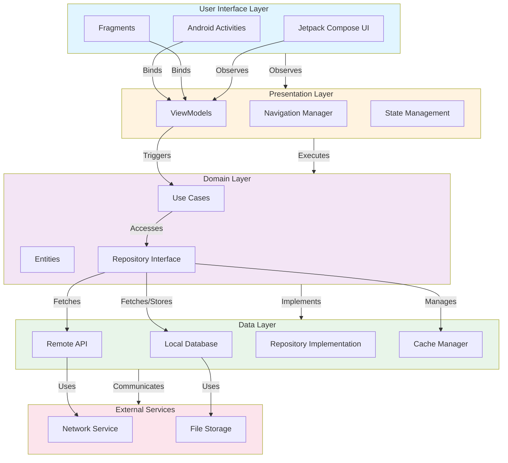

# M3-Play Architecture Overview

This document provides an overview of the M3-Play application architecture using a diagram-based approach.

## Architecture Diagram

## Layer Descriptions

### UI Layer
- **Android Activities & Fragments**: Main entry points for user interaction
- **Jetpack Compose UI**: Modern declarative UI toolkit for Android

### Presentation Layer
- **ViewModels**: Manage UI state and handle lifecycle awareness
- **Navigation Manager**: Coordinates screen transitions
- **State Management**: Manages application state

### Domain Layer
- **Use Cases**: Business logic encapsulation
- **Entities**: Core business objects
- **Repository Interface**: Abstraction for data access

### Data Layer
- **Local Database**: SQLite/Room database for local persistence
- **Remote API**: REST/GraphQL endpoints
- **Repository Implementation**: Concrete data access logic
- **Cache Manager**: In-memory caching for performance

### External Services
- **Network Service**: HTTP/Socket communication
- **File Storage**: Persistent file system operations

## Design Patterns

- **MVVM**: Model-View-ViewModel architecture
- **Clean Architecture**: Separation of concerns across layers
- **Repository Pattern**: Abstraction of data sources
- **Dependency Injection**: Inversion of control (likely using Hilt)

## Technology Stack

- **Language**: Kotlin
- **UI Framework**: Android Framework / Jetpack Compose
- **Architecture**: Clean Architecture with MVVM
- **Local Storage**: Room Database
- **HTTP Client**: Retrofit/OkHttp
- **Dependency Injection**: Hilt

---

*Last Updated: 2026-06-28*
